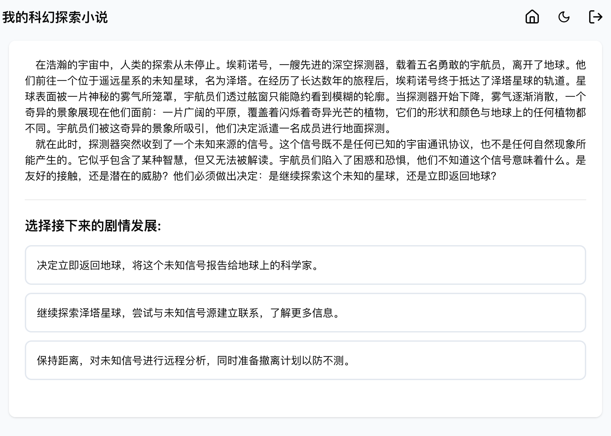

<div align="center">
<h1 align="center">AI-Novel</h1>

AI-Novel 是基于Next.js实现的大模型小说创作工具。通过该工具,你可以使用自定义大模型进行小说创作,并通过推理生成不同的剧情选项,以进行小说故事线的推进。


</div>

## 特性
- 使用自定义大模型进行小说创作
- 推理生成不同的剧情选项,以进行小说故事线推进



## 演示站点
- [AI-Novel 演示站点](https://ai-novel.shuaihao.vip)
- 演示站点使用glm-4-long模型,请不要滥用。

## 环境变量
>  AI-Novel项目需要一些环境变量才能正常运行。
>
> 请确保在部署或本地开发之前设置这些环境变量。
- NEXTAUTH_URL 搭建后的访问链接
- BASE_URL 模型Endpoint链接
- MODEL 模型名
- API_KEY 模型Key

## 部署指南

### 1. Docker部署方式
```bash
docker run -d \
  --name AI-Novel \
  -p 80:3000 \
  -e MODEL=glm-4-long \
  -e API_KEY=sk-xxxxxx \
  -e BASE_URL=https://aiproxy.gzg.sealos.run/v1/ \
  -e NEXTAUTH_URL=https://your-domain.com/ \
  ghcr.io/shuaihaov/ai-novel:main
```

### 2. Docker Compose部署

```bash
mkdir AI-Novel && cd AI-Novel
mkdir ./data && chmod -Rf 777 ./data
wget https://github.com/shuaihaoV/AI-Novel/raw/main/docker-compose.yml

# 修改环境变量
vim docker-compose.yml

# docker compose 启动
docker compose up -d
# 部分版本使用 docker-compose up -d 
```

## 贡献

如果您想为AI-Novel贡献代码或提供反馈，请遵循以下步骤：

1. Fork 项目仓库。
2. 创建您的特性分支 (`git checkout -b feature/AmazingFeature`)。
3. 提交您的更改 (`git commit -m 'Add some AmazingFeature'`)。
4. 将您的更改推送到分支 (`git push origin feature/AmazingFeature`)。
5. 打开一个Pull Request。

## 支持

如果您在使用AI-Novel时遇到问题或需要帮助，请通过以下方式联系我们：

- 在本项目的 [Issues](https://github.com/shuaihaoV/AI-Novel/issues) 页面提交问题

## 项目依赖

- [Next.js](https://nextjs.org/) - 用于构建应用程序的React框架。
- [radix-ui](https://radix-ui.com/) - 用于构建UI的React组件库。

## 致谢

- 参考了[Linux.do/TQmyLady](https://linux.do/t/topic/601900/40)项目的实现